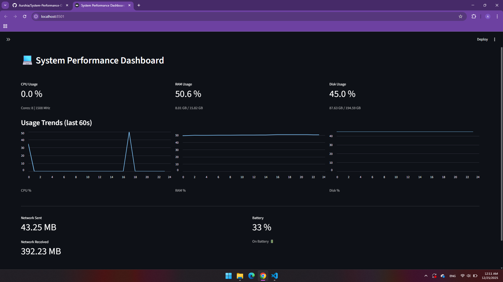

# System Performance Dashboard

A simple Streamlit dashboard that shows live system metrics like CPU, RAM, disk, network, and battery status.

## Features

- Live auto-refresh every second
- CPU usage, core count, and current frequency
- Memory usage (used/total)
- Disk usage (used/total)
- Network I/O (sent/received)
- Battery percentage and charging status (if available)
- Live line charts for CPU, RAM, and disk usage (last 60 seconds)
- Custom sidebar styling via `style.css`

## Screenshot



## Requirements

- Python 3.8+
- Dependencies:
  - `streamlit`
  - `psutil`
  - `streamlit-autorefresh`

## Setup

Create and activate a virtual environment (optional but recommended), then install dependencies:

```bash
python -m venv .venv
source .venv/bin/activate  # On Windows: .venv\Scripts\activate
pip install -r requirements.txt
# or
pip install streamlit psutil streamlit-autorefresh
```

## Run

From the project directory:

```bash
streamlit run project1.py
```

Open the local URL shown in the terminal (typically `http://localhost:8501`).

## Project Structure

```
.
|-- project1.py   # Streamlit app
|-- style.css     # Sidebar branding styles
|-- output.png    # Screenshot
|-- requirements.txt  # Python dependencies
`-- README.md     # Project documentation
```

## How It Works

- `psutil` collects system metrics (CPU, memory, disk, network, battery).
- `streamlit` renders the UI with metrics and captions.
- `streamlit-autorefresh` refreshes the app every second to keep values current.
- Usage history is stored in `st.session_state` and rendered as line charts.
- `style.css` adds a Streamlit logo to the sidebar.

## Notes and Limitations

- Disk usage auto-selects `C:\` on Windows or `/` on Unix-like systems. Change the path in `disk_info()` if you want a different mount.
- Battery metrics depend on hardware and OS support; desktops may show "No battery detected."

## Customize

- Adjust refresh interval in `project1.py`:

  ```python
  st_autorefresh(interval=1000, key="refresh")
  ```

- Adjust how much history is shown in charts:

  ```python
  HISTORY_LIMIT = 60
  ```

- Edit `style.css` to change sidebar branding.

## Troubleshooting

- If you see `ModuleNotFoundError`, reinstall dependencies:

  ```bash
  pip install -r requirements.txt
  # or
  pip install streamlit psutil streamlit-autorefresh
  ```

- If disk usage is incorrect for your system, update the path used in `disk_info()`.
